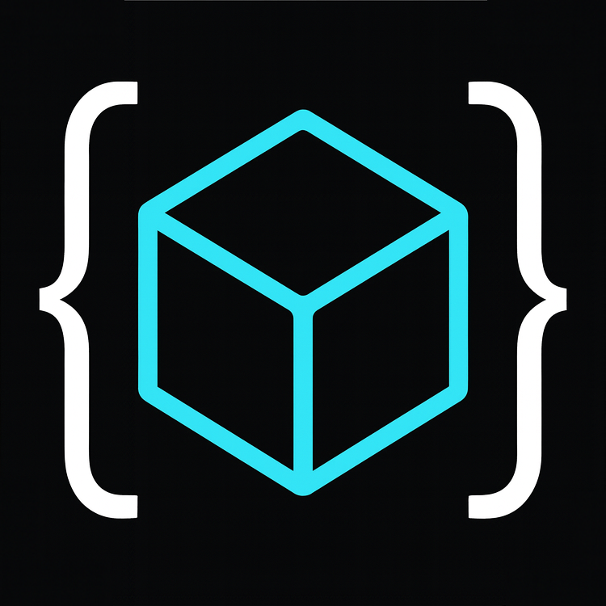
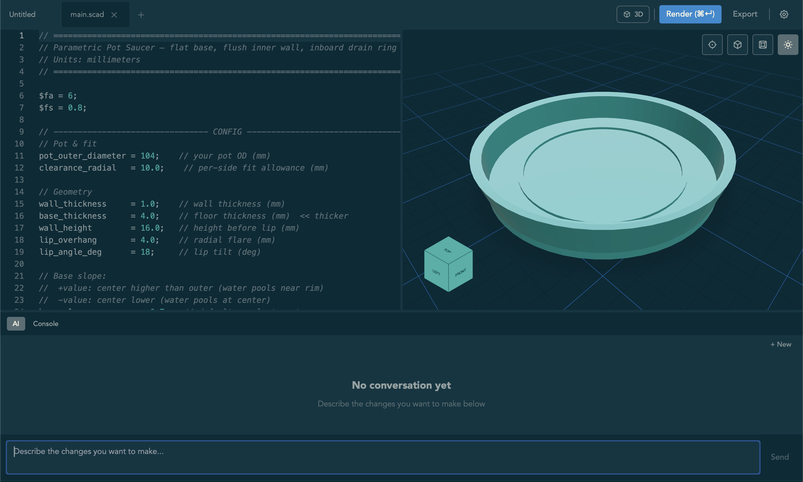

<p align="center">
  
</p>

<h1 align="center">OpenSCAD Studio</h1>

<p align="center">
  <strong>A modern cross-platform OpenSCAD editor with live preview and AI copilot</strong>
</p>

<p align="center">
  
  
  
  
  
</p>

> **⚠️ Early Alpha Software**
> This project is in early alpha and has only been tested on macOS. Windows and Linux support is planned but not yet implemented or tested.

---

<p align="center">
  
</p>

## ✨ Motivation

As a software engineer and maker hobbyist, I love OpenSCAD. It allows for precision and maps to my mental model of building things. However, some operations (like rounding with `minkowski`) are not very intuitive. At work, I often use Cursor and Claude Code for writing code, and found myself plugging my OpenSCAD code into ChatGPT in order to either (1) scaffold out a starting point or (2) fix a confusing issue in my code. I also became frustrated by certain limitations of the OpenSCAD editor, like not being able to easily indent code with the editor commands I'm used to. Lastly, for 2d graphics (which I often create for laser cutting), the preview experience as a 3D view feels very strange. So I built OpenSCAD Studio, which aims to be something like a Cursor for the language.

## ✨ Features

* Built in AI chat that can edit the code and view diagnostics
* First-class 2D graphics support with a separate SVG viewer
* Modern code editor with auto-formatting using Monaco & Tree Sitter

### 🎨 Editor
- **Monaco Editor** with custom OpenSCAD syntax highlighting
- **Multi-tab editing** with drag-and-drop reordering
- **Auto-save** and unsaved changes tracking
- **Format on save** with configurable indentation
- **Keyboard shortcuts** for common operations

### 🖼️ Preview
- **Live 3D mesh viewer** with orbit controls (Three.js + STL)
- **Fast PNG preview** while typing (< 500ms)
- **2D SVG mode** for 2D designs
- **Auto-detect dimension mode** (2D vs 3D)
- **Content-hash caching** for instant re-renders

### 🤖 AI Copilot
- **Diff-based editing** with validation and rollback
- **Streaming responses** with real-time tool visualization
- **Security-first** architecture (API keys in OS keychain)
- **Test compilation** before accepting changes
- **Multi-turn conversations** with context preservation

### 🚀 Export & Diagnostics
- **Export to multiple formats**: STL, OBJ, AMF, 3MF, PNG, SVG, DXF
- **Real-time error diagnostics** with inline markers
- **OpenSCAD stderr parsing** with line/column precision
- **Auto-detect OpenSCAD** installation

### Limitations

OpenSCAD Studio is a very new project and still does not support everything that OpenSCAD does. The main ones right now:

* No support for special operators (!, #, etc)
* No customizer support

## 📦 Installation

### Prerequisites

1. The **opescad** cli binary must be installed and available in your PATH. You can install via package manager:
  - macOS: `brew install openscad`
  - Ubuntu: `sudo apt install openscad`
  - Windows: Download installer from website

2. For development, you'll need:
   - **Node.js** 18+ and **pnpm**
     ```bash
     npm install -g pnpm
     ```
   - **Rust** toolchain (for building Tauri backend)
     ```bash
     curl --proto '=https' --tlsv1.2 -sSf https://sh.rustup.rs | sh
     ```

### Development

```bash
# Install dependencies
pnpm install

# Run in development mode (with hot reload)
pnpm tauri:dev

# Build for production
pnpm tauri:build
```

The built application will be in `apps/ui/src-tauri/target/release/bundle/`.

## 🏗️ Project Structure

```
openscad-studio/
├── apps/
│   ├── ui/                      # React + Vite frontend
│   │   ├── src/
│   │   │   ├── api/             # Tauri IPC wrappers
│   │   │   ├── components/      # React components
│   │   │   ├── hooks/           # Custom React hooks (useOpenScad, useAiAgent)
│   │   │   ├── stores/          # State management
│   │   │   └── themes/          # Theme definitions
│   │   └── src-tauri/           # Rust backend
│   │       ├── src/
│   │       │   ├── cmd/         # Tauri commands (render, AI tools)
│   │       │   └── utils/       # OpenSCAD parser, caching
│   │       └── Cargo.toml
│   └── sidecar/                 # AI Agent sidecar (Node.js)
│       └── src/
│           └── agent-server.ts  # Vercel AI SDK + tools
└── packages/
    └── shared/                  # Shared TypeScript types (Zod schemas)
```

## 🤖 AI Copilot Setup

The AI copilot uses a secure sidecar architecture with API keys stored in your OS keychain.

1. Open Settings (⌘,)
2. Navigate to "AI" tab
3. Enter your Anthropic / OpenAI API key
4. Key is securely stored in macOS Keychain / Windows Credential Manager / Linux Secret Service

**Supported Providers:**
- Anthropic
- OpenAI

The AI can:
- View your current code and preview
- Make targeted code changes with exact string replacement
- Check for compilation errors
- All edits are validated and test-compiled before acceptance

## 📚 Documentation

- **[CLAUDE.md](CLAUDE.md)** - Comprehensive guide for AI assistants and contributors
- **[AGENTS.md](AGENTS.md)** - AI agent architecture and tool definitions
- **[ROADMAP.md](ROADMAP.md)** - Detailed development roadmap with phases

## 🗺️ Roadmap

- ✅ **Phase 1-2 (Completed)**: Monaco editor, live preview, 3D viewer, export, caching
- 🚧 **Phase 3 (In Progress)**: AI copilot with sidecar architecture
- 🔜 **Phase 4 (Planned)**: Multi-file projects, testing, distribution

See [ROADMAP.md](ROADMAP.md) for detailed breakdown.

## 🤝 Contributing

Contributions are welcome! Please:

1. Check existing issues or create a new one to discuss your idea
2. Fork the repository and create a feature branch
3. Follow the code style (rustfmt for Rust, prettier for TypeScript)
4. Update documentation as needed
5. Submit a pull request

For detailed development guidelines, see [CLAUDE.md](CLAUDE.md).

## 📄 License

MIT License - see [LICENSE](LICENSE) for details.

## 🙏 Acknowledgments

Built with:
- [Tauri](https://tauri.app/) - Rust-powered desktop framework
- [React](https://react.dev/) - UI framework
- [Monaco Editor](https://microsoft.github.io/monaco-editor/) - Code editor
- [Three.js](https://threejs.org/) - 3D rendering
- [Vercel AI SDK](https://sdk.vercel.ai/) - AI agent framework
- [OpenSCAD](https://openscad.org/) - The amazing CSG tool this editor is built for

---

**Made with ❤️ for the OpenSCAD community**
