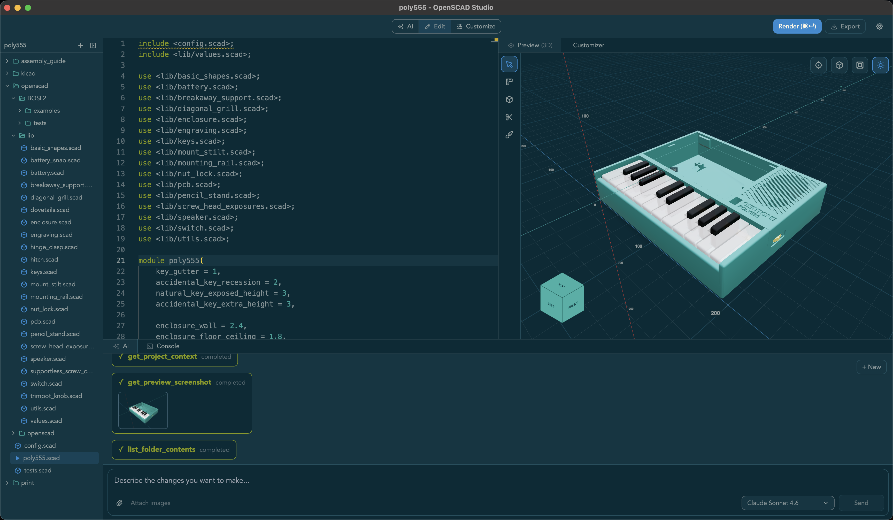

<p align="center">
  
</p>

<h1 align="center">OpenSCAD Studio</h1>

<p align="center">
  <strong>From idea to 3D printed part in seconds</strong>
</p>

<p align="center">
  <a href="https://openscad-studio.pages.dev"></a>
  
  
  
  
</p>

> **🌐 Try it now** — OpenSCAD Studio is available as a [web app](https://openscad-studio.pages.dev) (no install needed) or as a [macOS desktop app](#desktop-macos). The web version runs entirely in your browser using WebAssembly. The desktop app bundles a native OpenSCAD binary for faster rendering and full filesystem access.
>
> **Desktop:** macOS 10.15 (Catalina) or later.

---

<p align="center">
  
</p>

## 🔩 What It Is

OpenSCAD Studio is a professional editor for OpenSCAD — the programmable solid 3D and 2D CAD modeler. It replaces the stock OpenSCAD editor with a modern development environment purpose-built for makers: live preview, real-time diagnostics, an AI copilot, and a full multi-file project workflow.

## ✨ Features

### Editor
- **Multi-file projects** — File tree, multiple tabs, and `include`/`use` path resolution against the project root (desktop)
- **Real-time diagnostics** — Inline error and warning markers with line/column precision parsed directly from the OpenSCAD compiler
- **Monaco-based editing** — OpenSCAD syntax highlighting, multi-tab support, formatter, and vim mode with configurable keybindings

### Preview
- **Live 3D preview** — Interactive mesh viewer with orbit controls, orthographic mode, wireframe, shadows, and section planes
- **2D mode** — Dedicated SVG viewer for laser cutting and engraving workflows
- **Measurement tools** — In-canvas 2D and 3D measurement overlays
- **Customizer panel** — Interactive parameter controls auto-generated from your OpenSCAD file, with live re-rendering on change

### AI Copilot
- **In-app chat** — Stream responses from Claude or GPT to generate, explain, and fix OpenSCAD code (bring your own API key)
- **MCP support (desktop)** — Exposes a localhost MCP server so external agents like [Claude Code](https://claude.ai/code) can render models, read diagnostics, capture screenshots, and edit files in your active workspace

### Platform
- **Runs everywhere** — Web app at [openscad-studio.pages.dev](https://openscad-studio.pages.dev) and macOS desktop app 
- **Share links** — Publish browser-based share links with thumbnail previews for remixable examples

**Known limitation:** Special operators (`!`, `#`, `%`, `*`) are not yet reflected in the preview.

## 📦 Installation

### Web (No Install)

Visit **[openscad-studio.pages.dev](https://openscad-studio.pages.dev)**. Works in recent Chrome, Edge, and Firefox builds with SharedArrayBuffer support. No OpenSCAD installation needed — rendering is done via WebAssembly in your browser.

### Desktop (macOS)

Install via Homebrew:

```bash
brew tap zacharyfmarion/openscad-studio
brew install --cask openscad-studio
```

Or download the latest DMG from [GitHub Releases](https://github.com/zacharyfmarion/openscad-studio/releases). Requires macOS 10.15 (Catalina) or later.

### Development

Local setup, share-feature testing, project structure, AI setup, and contributor-facing references now live in [DEVELOPMENT.md](DEVELOPMENT.md).

## 🤝 Contributing

Contributions are welcome! Please:

1. Check existing issues or create a new one to discuss your idea
2. Fork the repository and create a feature branch
3. Follow the code style (prettier for TypeScript, rustfmt for Rust)
4. Update documentation as needed
5. Submit a pull request

For detailed development guidelines, see [CLAUDE.md](CLAUDE.md) and [CONTRIBUTING.md](CONTRIBUTING.md).

## 📄 License

This project is licensed under the GNU General Public License v2.0 - see [LICENSE](LICENSE) for details.

This license change was made to comply with OpenSCAD's GPL-2.0 license, as the project bundles openscad-wasm (web) and the native OpenSCAD binary (desktop).

## 🙏 Acknowledgments

Built with:

- [Tauri](https://tauri.app/) - Rust-powered desktop framework
- [React](https://react.dev/) - UI framework
- [Monaco Editor](https://microsoft.github.io/monaco-editor/) - Code editor
- [Three.js](https://threejs.org/) - 3D rendering
- [OpenSCAD](https://openscad.org/) - The amazing CSG tool this editor is built for
- [openscad-wasm](https://github.com/nicolo-ribaudo/openscad-wasm) - WebAssembly build of OpenSCAD
- [Vercel AI SDK](https://sdk.vercel.ai/) - AI streaming framework

---

**Made with ❤️ for the OpenSCAD community**
